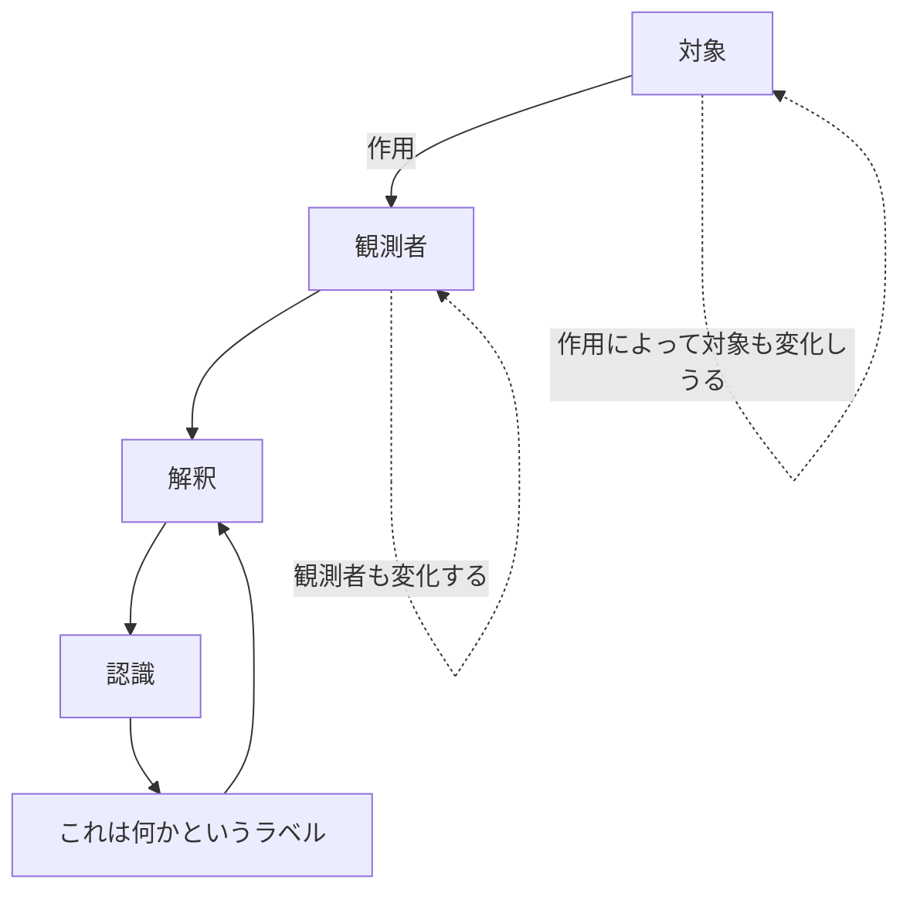
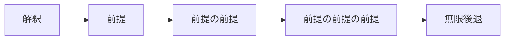
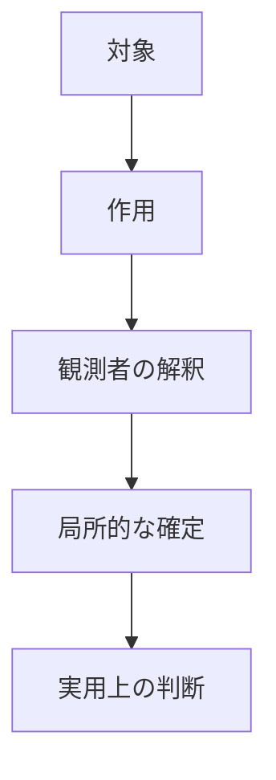
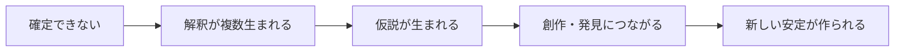
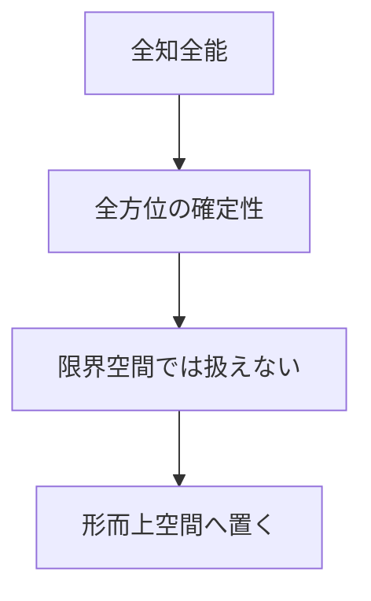
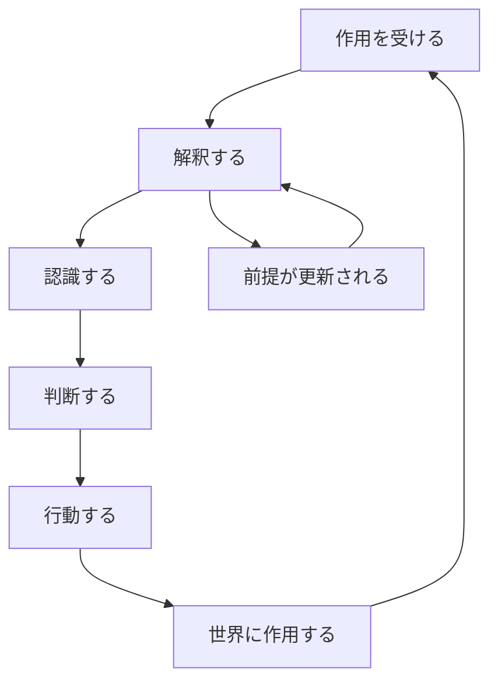
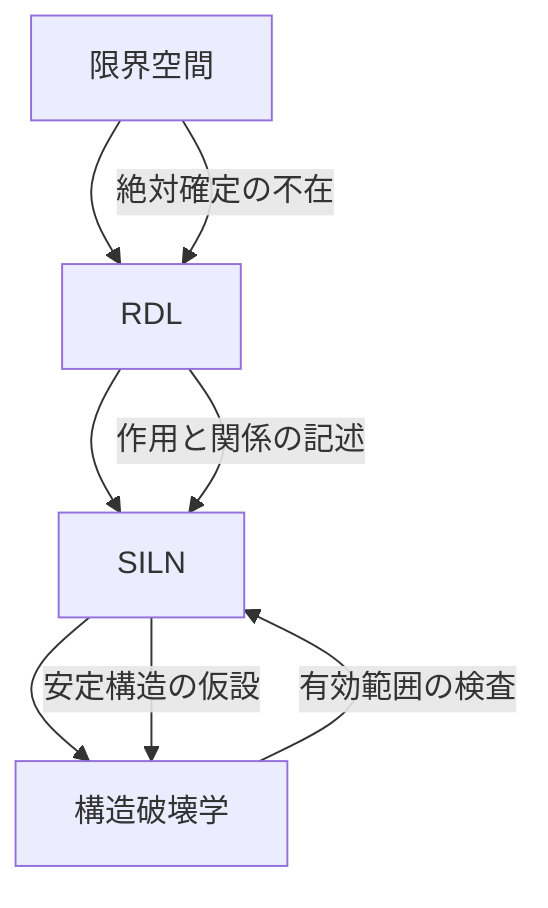

## はじめに

この文章では、**限界空間**という思考のための枠組みを整理する。

限界空間とは、簡単に言えば、次の前提から始まる思考空間である。

:::message
私たちは、世界そのものを直接見ているのではなく、
世界から受けた作用を解釈している。
:::

つまり、私たちが「物を見ている」と思っているとき、実際にはその物から来た光・音・手触り・言葉・記憶・文脈などの作用を受け取り、それを自分の中で解釈している。

この時点で、すでに問題が生まれる。

- 観測するには、対象に何らかの作用が必要になる
- 作用すると、対象は変化する可能性がある
- 観測者も、受け取った作用によって変化する
- 解釈には前提が必要だが、その前提も絶対とは言い切れない

このように考えると、私たちは「純粋な物そのもの」や「絶対的な確定」に到達できない可能性がある。

限界空間は、この限界を悲観するためのものではない。

むしろ、**確定できないからこそ、解釈・仮説・創作・思考の余地が生まれる**と考える。

---

## 限界空間の最小定義

まず、限界空間を最小限に定義する。

:::message
限界空間とは、絶対的な確定に到達できないことを前提に、
観測・作用・解釈・変化の中で世界を考えるための思考空間である。
:::

もう少し短くすると、こうなる。

```text
限界空間 = 確定不能性を前提にした思考空間
```

ここで重要なのは、限界空間が「何も分からない」と言っているわけではないことだ。

むしろ逆である。

「絶対には届かない」と認めることで、局所的な安定、使える仮説、観測可能な作用、解釈の差分を扱えるようにする。

---

## 観測とは何か

何かを観測するには、その対象から何らかの作用を受ける必要がある。

たとえば、リンゴを見る場合を考える。

- リンゴに光が当たる
- 反射した光が目に入る
- 視覚情報が脳で処理される
- 過去の経験や言語と照合される
- 「これはリンゴだ」と解釈される

この流れを見ると、私たちはリンゴそのものに直接触れているのではなく、リンゴから来た作用を受け取り、それを解釈していることが分かる。



この構造では、対象と観測者は完全には切り離せない。

観測は、対象に触れる。

そして、観測者もまた観測によって変化する。

---

## なぜ確定できないのか

限界空間では、絶対的な確定は扱えない。

理由は大きく三つある。

### 1. 観測には作用が必要だから

観測は、対象から何らかの作用を受け取ることで成立する。

しかし、作用があるということは、対象や観測者に変化が起きる可能性があるということでもある。

### 2. 解釈には前提が必要だから

何かを「これはリンゴだ」と認識するには、リンゴという概念、視覚処理、言語、経験などの前提が必要になる。

しかし、その前提が絶対に正しいかどうかは、さらに別の前提によって判断される。



このように、前提はどこまでも遡れてしまう。

そのため、絶対的な基礎を置くことは難しい。

### 3. 観測者も構造の一部だから

観測者は、世界の外側に立っているわけではない。

観測者自身も、作用を受け、変化し、解釈し続ける構造である。

そのため、完全に外側から世界を眺める視点は持てない。

:::message alert
限界空間では、「完全に外側から見る視点」は仮定できない。
観測者もまた、作用と変化の中に含まれている。
:::

---

## 「確定できない」は「何も分からない」ではない

ここで誤解しやすい点がある。

限界空間は、世界について何も語れないと言っているわけではない。

:::message alert
限界空間は、思考停止のための空間ではない。
絶対的確定を諦める代わりに、局所的な安定や使える解釈を扱うための空間である。
:::

たとえば、目の前に鉄球が飛んできたとする。

限界空間では「鉄球の絶対的実在は確定できない」と考えることはできる。

しかし、それでも避けた方がよい。

なぜなら、私たちの身体や経験の範囲では、鉄球に当たると危険であるという解釈は非常に安定しているからである。

```text
絶対的に確定できない
≠
実用的に何も判断できない
```

限界空間では、絶対的真理ではなく、**有効な安定**を扱う。

---

## シュレーディンガーの猫を限界空間で読む

有名な思考実験に、シュレーディンガーの猫がある。

箱の中に猫がいて、観測するまでは生きているか死んでいるか分からない、という話である。

通常は、量子力学における観測問題を説明する例として扱われる。

しかし、限界空間ではこれをもう少し広く読む。

:::message
問題は箱の中の猫だけではない。
目の前のリンゴでさえ、絶対的には確定できない。
:::

つまり、限界空間では「箱の中だから分からない」のではない。

そもそも、どんな対象でも、私たちは作用と解釈を通してしか扱えない。

だから、確定とは常に局所的な確定である。



この見方では、量子の奇妙さは「世界の例外」ではなく、限界空間の性質が分かりやすく現れた例として読める。

---

## 限界は閉塞ではなく可能性である

限界空間という名前だけを見ると、閉じ込められた空間のように感じるかもしれない。

しかし、実際には逆である。

確定できないからこそ、複数の解釈が並び立つ。

複数の解釈があるからこそ、仮説が生まれる。

仮説が生まれるからこそ、創作や発見が起きる。



限界空間において、限界は壁ではない。

限界は、思考が展開するための余白である。

:::message
限界とは、可能性が閉じる場所ではなく、
解釈が開く場所である。
:::

---

## 全知全能は扱えない

限界空間で扱えないものがある。

それは、全知全能である。

全知全能とは、全方位に確定性を持つ性質である。

しかし、限界空間では絶対的確定が成立しない。

そのため、全知全能は限界空間の中では再現できない。



ただし、重要な補足がある。

限界空間では、全知全能を「証明」したり「再現」したりすることはできない。

しかし、**信じること**はできる。

:::details 信じることと扱うことの違い
限界空間では、語りえないものを完全に記述することはできない。

しかし、それを信仰・物語・祈り・希望として持つことはできる。

つまり、限界空間が拒否するのは「絶対的に確定した対象として扱うこと」であって、
「信じること」そのものではない。
:::

---

## 限界空間の基本ループ

限界空間では、世界を次のようなループとして見ることができる。



私たちはこのループの外には出られない。

しかし、このループを自覚することはできる。

そして、自覚できるなら、使い方を変えることもできる。

---

## 限界空間の使い方

限界空間は、答えを与える理論ではない。

思考を行うための空間である。

使い方としては、次のような問い方が向いている。

| よくある問い | 限界空間的な問い |
| ---- | ---- |
| これは本当に正しいのか？ | どの境界では安定しているのか？ |
| 本質は何か？ | どの作用に対して、何が安定して見えているのか？ |
| これは存在するのか？ | どのような作用として現れているのか？ |
| 意味は何か？ | どの文脈で、どの接続が生まれているのか？ |
| 答えは一つか？ | 複数の解釈はどの境界で並立しているのか？ |

特に重要なのは、「何であるか」よりも「どう作用しているか」を見ることである。

```text
存在を問う
↓
作用を見る
↓
安定性を見る
↓
使える解釈を仮設する
```

---

## RDLとの接続

限界空間は、RDL（関係力学言語）の前提層として使える。

限界空間が扱うのは、認識の限界である。

RDLが扱うのは、その限界の中で見える関係・作用・安定・変化である。

| 層 | 役割 |
| ---- | ---- |
| 限界空間 | 絶対的確定に届かないという前提を置く |
| RDL | 作用・関係・安定・変化を記述する |
| SILN | 安定して見える構造を扱いやすくする |
| 構造破壊学 | 構造の有効範囲と破断条件を調べる |

この関係を図にすると、次のようになる。



限界空間がなければ、RDLは単なる世界観になりやすい。

限界空間を前提に置くことで、RDLは「絶対的に正しい理論」ではなく、**限界の中で使う記述道具**として扱える。

---

## 応用例

### 例1：科学

科学は、安定しているように見える。

しかし、それは科学が絶対的真理だからではない。

科学は、仮説に対して実験や観測という作用を与え、その仮説がどこまで耐えるかを調べる。

つまり、科学は安定性を積極的に壊しにいくことで、より強い安定を作っている。

:::message
科学は、構造を壊して耐久性を測ることで安定している。
:::

### 例2：数学

数学は演繹によって強い安定性を持つ。

しかし、その出発点には公理がある。

公理は、それ以上疑わないものとして置かれる前提である。

そのため、数学の安定性は「公理の中での安定性」として読める。

### 例3：物語

物語は現実ではない。

しかし、物語は人間に作用する。

人を励ましたり、共同体を作ったり、行動を変えたりする。

限界空間では、実在かどうかだけではなく、**どのような作用を持つか**を見ることができる。

---

## 誤解されやすい点

### 誤解1：相対主義なのか？

限界空間は、何でもありの相対主義ではない。

確定できないことと、何を言っても同じということは違う。

作用に対して安定している解釈と、すぐ壊れる解釈は区別できる。

### 誤解2：現実を否定しているのか？

現実を否定しているわけではない。

ただし、現実を「絶対的にそのまま把握している」とは言わない。

限界空間では、現実は作用と解釈を通して扱われる。

### 誤解3：何も決められなくなるのか？

むしろ逆である。

絶対的確定を待たずに、局所的な安定をもとに判断できるようになる。

:::message alert
限界空間は、決断を遅らせるための理屈ではない。
絶対に届かなくても、局所的に十分安定しているなら行動できる。
:::

---

## まとめ

限界空間とは、絶対的な確定に届かないことを前提にした思考空間である。

私たちは、世界そのものを直接見ているのではなく、作用を受け取り、それを解釈している。

観測には作用が必要であり、作用は対象や観測者を変化させる。

解釈には前提が必要だが、その前提も絶対とは言い切れない。

だから、限界空間では絶対的確定を扱わない。

しかし、それは何も分からないという意味ではない。

局所的な安定、実用的な判断、複数の解釈、創作や仮説の余地を扱うために、限界空間は開かれている。

```text
限界空間とは、答えを与える場所ではない。
答えが確定しない世界で、どう考えるかを試す場所である。
```

---

## 最後に

限界空間は、閉じた理論ではない。

むしろ、閉じることを拒むための空間である。

この空間で何を見つけるか。

何を予測するか。

何を発見するか。

それは、使う人の境界の引き方によって変わる。

:::message
ここは答えを与えない。
単なる思考空間である。
:::

